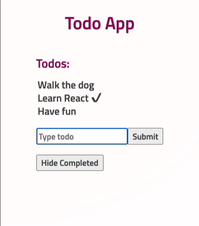

# Class Based Components - React Todo

We're going to practice building class components with this project. Even though hooks are gaining popularity among react developers, class components are going to be around for a long time. It's imperative that you get use to class components, and feel comfortable working with class components since you'll most likely need to work with them if you are hired to work on a React app.

## Objectives

- Build class components from scratch
- Defining application state
- Defining component state
- Connecting state changes to components

## Introduction

In this project you will build an application that allows for todos to be added, toggle and checked off. Please use ALL CLASS BASED COMPONENTS when creating this application and use the Guided project as a model. This application should:

- Use the following gif as base for building DOM:



- Hold all todos in state within the App.js component. That todos state slice should look like the following:

```js
[
  {
    name: 'Organize Garage',
    id: 1528817077286,
    completed: false
  },
  {
    name: 'Bake Cookies',
    id: 1528817084358,
    completed: false
  }
]
```

- Allow for a todo to be toggled when clicking on an item.
- Allow for a todo be be added when submitting the todo form component.
- Allow for completed todos to be cleared when clicking the clear completed button.

***Make sure to complete your tasks one at a time and complete test each task before proceding forward.***

## Instructions

### Task 1: Project Set Up

- Fork, clone, and `npm install`.
- Launch the project on a development server executing `npm run dev`.
- Visit your widget by navigating to `http://localhost:3000` with Chrome.

### Task 2: Project Requirements

- Build all components as class components. Find them inside `frontend/components`.
- Don't focus on styling yet. We want you to worry about function over form today.
- Your todo list should display a list of todos, an input field, a submit button, and a clear all button.
- `<App />` will hold all the data needed for this project. It will also be the container for your Todo Components.
  - All of your application data will be stored here on `<App />`.
  - All of your `handler` functions should live here on `<App />`.
- `<TodoList />` receives your Todos array and iterates over the list generating a new `<Todo />` for each element in the array.
- `<Todo />` is a component that takes in the `todo` data and displays the task to the screen.
- `<Form />` will hold your input field and your `Add Todo` and `Clear Completed` buttons.
  - Your input field should take in user input, and allow a user to press `Enter` or click on the `Submit Button` to add a todo to your list.
  - Once a todo is submitted, the Todo List should re-render and show the added todo.

## Submission Format

- [ ] Only work on main.
- [ ] Try to avoid committing broken code.
- [ ] Make sure to push code at regular intervals.
